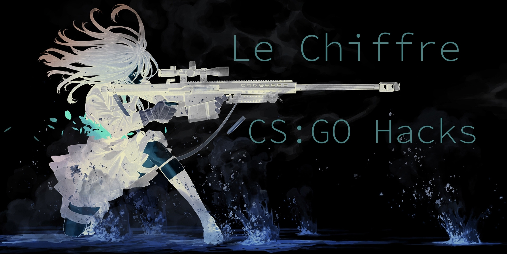

**Le Chiffre - is a lightweight opensource CS:GO external cheat, which supports lots of features.**

## About
Le Chiffre - is an external feature-rich hack.\
Since it is a public cheat, I strongly recommend reimplementing the cheat logic to make it as unique as possible, or at least changing the filename (as well as it's hash) of the executable file after compilation to minimise the VAC ban risks.\
Also it might be useful to add some junk code in some cases (probably you'd have to turn compiler optimisations off before doing it).\
It's recommended to use [VAC Bypass](https://github.com/danielkrupinski/VAC-Bypass-Loader) to bypass anti-cheat scan and drastically reduce the likelihood of a VAC ban.\
\
You have to use at least the C++17 standard (due to bsp_parser library requirements) to compile the cheat.\
[Le Chiffre official website](https://lechiffre.now.sh)

## Cheat functions
- F2 - Bunnyhop
- F3 - No flashbang
- F4 - Activate Aim bot
- F6 - Activate trigger bot
- LAlt - Use trigger bot
- F8 - Enemy glow ESP
- F9 - Radar hack
- END - Panic mode (exits cheat immediately)

## Features to be made in future
- CS:GO Overlay to show info like bomb ticker, spectators, etc.
- Aim assist.
- Improve ESP (show the bomb, bomb carrier in a different colour, etc).
- CS:GO offsets autoparser.

## Building the cheat yourself
This project already includes all it's configuration in the .vcxproj file, so if you're using Visual Studio 2019 (or maybe even some earlier versions) it should work and compile fine, just make sure to build it as a x86 Release file.\
But for some reason sometimes Visual Studio may ignore the project configurations, so you'll have to set it manually.\
These are the most frequent issues people can meet while building this project:
 - in project settings you have to set C++ standard as `C++ 2017` or `C++ latest`, it's a requirement of the `bsp_parser` library, which this cheat relies on.
 - in ProjectProperties -> Configuration Properties -> C/C++ -> Preprocessor -> Preprocessor Definitions you have to add the following macros: `_CRT_SECURE_NO_DEPRECATE` and `_CRT_NONSTDC_NO_DEPRECATE`.
 - in Linker settings, the `System` settings has to be set as `Windows (/SUBSYSTEM:WINDOWS)`, as this project is not using the regular `main` funciton as an entry point. 

## Credits
Thanks to [hazedumper](https://github.com/frk1/hazedumper "hazedumper") library for providing memory offsets.\
Thanks to [bsp_parser](https://github.com/ReactiioN1337/valve-bsp-parser "bsp_parser") library for making the aimbot even better.
