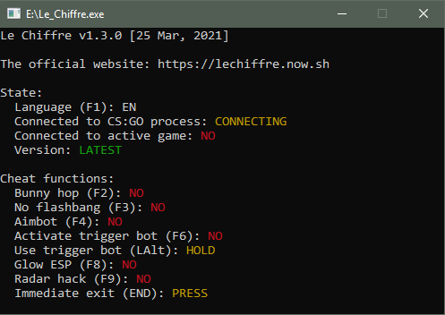

**Le Chiffre - is a lightweight opensource CS:GO external cheat, which supports lots of features.**

## About
Le Chiffre - is an external feature-rich hack.\
Since it is a public cheat, I recommend changing the filename (as well as it's hash) of the executable file after compilation to minimise the VAC ban risks.\
Also it might be useful to add some junk code before compilation.\
You have to use at least the C++17 standard (due to bsp_parser library requirements) to compile the cheat.

## Cheat functions
- F2 - Bunnyhop
- F3 - No flashbang
- F4 - Activate Aim bot
- F6 - Activate trigger bot
- LAlt - Use trigger bot
- F8 - Enemy glow ESP
- F9 - Radar hack
- END - Panic mode (exits cheat immediately)

## Features to be made in future
- CS:GO Overlay to show info like bomb ticker, spectators, etc.
- Aim assist.
- Improve ESP (show the bomb, bomb carrier in a different colour, etc).
- Encrypt all strings on compile time (using XOR encryptions, for instance).
- Make all features asynchronous for speed performance.
- CS:GO offsets autoparser.

## Credits
Thanks to [hazedumper](https://github.com/frk1/hazedumper "hazedumper") library for providing memory offsets.\
Thanks to [bsp_parser](https://github.com/ReactiioN1337/valve-bsp-parser "bsp_parser") library for making the aimbot even better.